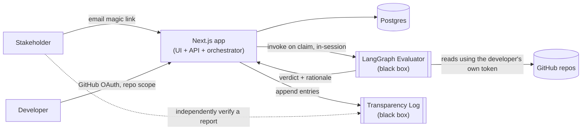

# ZKCVP

Lets developers give stakeholders verifiable progress updates without granting them
direct access to a private repo. A stakeholder defines requirements as a checklist; a
developer claims that specific commits satisfy a specific requirement; an LLM-based
agent independently reads the actual code at those commits and renders a verdict; the
result is recorded and (eventually) made tamper-evident via an independent log.

## Naming & trust model — read before assuming otherwise

"Zero-knowledge" in the project name is positioning language, not a technical claim —
**no cryptographic ZK proofs exist anywhere in this design.** The actual trust mechanism
has two independent parts, and it matters to keep them distinct:

1. An LLM agent reads real code and reports its own judgment. This is not, and cannot
   currently be made, cryptographically verifiable — see the Evaluator contract below.
2. A transparency log (also not yet built) makes the *record* of that judgment
   tamper-evident after the fact. It proves the report wasn't quietly altered later; it
   does **not** prove the judgment itself was correct. Do not conflate the two when
   describing this system to anyone.

There is also no on-chain execution anywhere — the orchestrator is a normal off-chain
service. If the transparency log ever anchors a checkpoint externally, that's the only
place a blockchain-adjacent technique enters this design, and only as a cheap notarization
mechanism, not for smart-contract execution.

## Getting started

```bash
npm install
cp .env.example packages/db/.env       # drizzle-kit + vitest read this one
cp .env.example apps/web/.env.local    # Next.js reads this one — same values
# fill in DATABASE_URL in both copies (Supabase → Project Settings → Database
# → Connection string → Transaction pooler); EVAL_CEILING_SECONDS defaults to 300
npm run verify   # typecheck + full test suite (hits the real DB) + design-system check
```

Nothing reads a root `.env` — see the comment in `.env.example` for why.

## Repo conventions

- This file is the map: high-level shape only, no implementation detail.
- `docs/plans/NN-feature-name.md` — the territory: a full, build-ready spec per feature,
  written once that feature's design is settled. Currently: `01-requirement-management.md`,
  `02-repo-attachment.md`.
- `docs/architecture.md` — how it is built: stack decisions, repo layout, and the milestone
  plan for what is not built yet.
- The repo is an npm workspace: `apps/web` is the deployable; `packages/contracts` (types
  only), `packages/db` (Drizzle schema), `packages/orchestrator` (stub), and
  `packages/design-system-ledger` are its workspace packages.

## Tech stack

| Concern | Decision |
|---|---|
| Framework | Next.js (TypeScript) — one app: UI, CRUD API, and orchestrator entrypoint |
| Framework version | Next.js 15.5.22, pinned exact — next-auth@5 is validated against Next 15 |
| Database | Postgres (Supabase-hosted) via Drizzle ORM over node-postgres |
| Orchestrator | LangGraph (TypeScript); LLM provider left configurable, not hard-coded |
| Developer auth & repo access | GitHub OAuth, requesting `repo` scope — one token serves both developer identity and all repo reads. No GitHub App, no installation, no service-level credential anywhere in this design. |
| Stakeholder auth | Email magic link — no shared password auth with developers |
| Token custody | Held only in the developer's session, never persisted to a table — a deliberate choice, not a limitation; see below |
| Deployment | Single deployable, host deliberately undecided — built host-agnostic (standalone Node output). Serverless (Vercel-class) and a long-lived Node host (Railway/Render/Fly-class) are both live options; see below |

Resolved constraint from an earlier design pass: since repo reads are authenticated as
the requesting developer's own live token rather than a stored service credential,
evaluation runs **synchronously**, inside the same request that submits a claim — no
background job, no queue, no persisted third-party credential to leak in a DB breach.
That reasoning is about token custody, not about the runtime, so it holds on any host.

What the host *does* decide is how much Evaluator work fits into one submission. On a
serverless platform, total work is capped by that request's execution-time ceiling —
low hundreds of seconds, platform- and plan-dependent. On a long-lived Node host there
is no such ceiling. A batched LangGraph run doing multi-turn file reads across several
commits is plausibly minutes-scale, so the difference is not theoretical — but it is a
*deployment-target* choice, not a framework one. The app is built not to care: the
orchestrator sits behind a clean entrypoint and the build emits a standalone Node
server, so moving between the two is a host swap rather than a rewrite. The choice gets
made once a real Evaluator run has been measured against a real repo.

## System components



| Component | Responsibility |
|---|---|
| Next.js app | UI, CRUD API, session/auth for both roles, houses the orchestrator entrypoint |
| Postgres | All relational state — projects, requirements + versions, memberships, invites, claims, verification records |
| GitHub OAuth (`repo` scope) | Developer identity **and** all repo reads — one token, held in-session only, never persisted |
| LangGraph Evaluator | Black box — given a requirement version + claimed commits, produces a verdict |
| Transparency Log | Black box — given event payloads, produces tamper-evident, independently-checkable records |

## Domain flow

1. Stakeholder signs up, creates a project, becomes its first stakeholder member.
2. Stakeholder defines requirements as a versioned checklist. → `docs/plans/01`
3. Stakeholder invites developers by GitHub handle; a developer's GitHub OAuth login
   activates matching pending invites automatically. → `docs/plans/01`
4. A developer attaches one or more GitHub repos to the project (picked from repos their
   own GitHub account can see — no separate installation/consent step). → `docs/plans/02`
5. A developer selects a requirement (pinned to its current version) and one or more
   (repo, commit) pairs, and submits a claim. → *not yet designed*
6. The claim invokes the Evaluator **synchronously, within that same request**, reading
   repo content using the submitting developer's own live OAuth token.
7. The Evaluator returns a verdict before the request completes; status is written
   directly to `verified` or `eval_failed` — there is no intermediate pending state, and
   **no human approval step exists anywhere in this design.**
8. *(Future)* Every event above is appended to the Transparency Log; anyone can
   independently verify a report hasn't been altered since it was recorded.

## Feature status

| Feature | Status |
|---|---|
| Requirement management (projects, RBAC, checklist + versioning) | Designed — `docs/plans/01-requirement-management.md` |
| Repo attachment & commit visibility | Designed — `docs/plans/02-repo-attachment.md` |
| Claim submission & verification invocation | Not yet designed |
| LangGraph Evaluator | Black-boxed — contract below, internals deferred |
| Transparency Log | Black-boxed — contract below, backend choice deferred |
| Application foundation (workspace, scaffold, contracts, schema) | Built — see `docs/architecture.md` |

## Black-box contracts

Both of the following are treated as black boxes on purpose: what each stage must
achieve is settled; how is deliberately not, until the rest of the app exists end-to-end.

### LangGraph Evaluator

**Goal**: given one *batch* of requirement versions and a specific set of claimed
commits (a single developer submission can target several requirements against the same
commit set at once), independently determine whether each claim holds — reading real
file contents *at those exact commits*, never live HEAD, since HEAD may have moved on
since the claim was made. Produce a separate verdict and rationale per requirement, not
one pooled result for the batch.

**Input**
```
claim:
  repoCommits: [{ repo, commitSha }, ...]        // one or more, shared across all requirements below
requirements:
  [{ requirementVersionId, title, description }, ...]   // one or more, evaluated together against the same claim
toolAccess: file content/diff access scoped to exactly those commit SHAs, authenticated
  as the requesting developer's own live GitHub OAuth token (repo scope) — never a
  service-level credential. This is why evaluation runs synchronously within the
  submitting developer's session rather than as a background job: there is no stored
  token a later process could use.
```

**Output — two structurally separate artifacts, never merged into one object**

1. **Evidence bundle** — the raw tool-call transcript (file reads/diffs, verbatim source).
   Contains real code from a private repo. **Not shown to the stakeholder in this
   phase** — stored only; no viewer or disclosure mechanism exists yet. This is what gets
   hashed for the Transparency Log's `evidence_hash` field. Two things deliberately left
   for later, not designed now: (a) a future feature could let a developer explicitly
   consent to sharing specific evidence with a stakeholder on request; (b) independent of
   whether the evidence is ever disclosed, the Transparency Log's `evidence_hash` lets
   anyone verify the evidence used was never altered after the fact *without exposing its
   contents at all* — verifying integrity and disclosing content are separate operations,
   and the first doesn't require the second.
   ```
   { evaluationId, claimId, toolCallLog: [...] }
   ```

2. **Report** — human language only, one entry per requirement in the batch, **always
   visible to the stakeholder as soon as the evaluation completes** — no developer
   consent step, no release flag, no gating of any kind:
   ```
   {
     evaluationId, claimId, modelId, promptTemplateVersion, createdAt,
     perRequirement: [
       { requirementVersionId, verdict: 'satisfied' | 'not_satisfied', rationale },
       ...
     ]
   }
   ```
   `rationale` must never embed verbatim source code — referencing a file path or a line
   range is fine, pasting literal code is not. This is a **generation-time constraint on
   the agent itself**, not a display-layer filter: filtering code out of an already-generated
   report after the fact is unreliable (missed cases, imperfect redaction), so the agent's
   output step must be constrained to never produce it in the first place.

**Visibility rule**: the report is unconditionally stakeholder-visible, immediately, for
every evaluation — this is what keeps the stakeholder-facing side of the product
functioning at all. The evidence bundle is the only thing withheld, and only because no
disclosure feature exists yet, not because of any consent mechanism on the report itself.

Not specified here: agent graph structure, prompting strategy, model choice, tool
implementation, retry/error handling.

### Transparency Log

**Goal**: make the historical record of every requirement edit, claim, and verification
result tamper-evident and independently checkable — without anyone having to trust the
app operator's word for it.

- **Input**: `append(entryType, canonicalPayloadHash, metadata) → { logRef }` — one call
  per event, at requirement created/edited, claim submitted, and verification result
  recorded.
- **Output**: `verify(content, logRef) → { valid, proof }` — recomputes the content hash
  and checks it against an inclusion proof and an independently-published checkpoint;
  callable by anyone, not just the app itself.

Not specified here: which log technology backs it (public Rekor / self-hosted Trillian /
hand-rolled Merkle structure), checkpoint-anchoring mechanism, client-side verification
library.

## Non-goals

- No cryptographic zero-knowledge proofs, no zkML — infeasible at LLM scale with current
  technology, not planned.
- No on-chain smart contract execution.
- No stakeholder approval step — verification outcome is fully automatic.
- No background/async verification jobs, no GitHub App/installation model, no persisted
  third-party access tokens — evaluation is synchronous, authenticated as the submitting
  developer's own session-held OAuth token.

## Open questions

- Claim/verification invocation design — the queue/background-job question is now
  resolved (synchronous, no queue), but request/response shape, error handling for a
  mid-run GitHub rate-limit or failure, and in-flight UI are still open.
- Future evidence-disclosure feature: a developer-consented way to reveal specific
  evidence-bundle contents to a stakeholder on request. Not designed, deliberately deferred.
- Deployment host — serverless vs. long-lived Node. Deferred until a real Evaluator run
  is measured against a real repo; the app is built host-agnostic so the answer changes
  a deployment target, not the architecture.
- Transparency Log backend choice (Rekor vs. self-hosted Trillian vs. hand-rolled MMR).
- ~~Auth implementation~~ — resolved: Auth.js v5, two separate instances (GitHub with no
  adapter; email magic link with a stakeholders-only adapter). See `docs/architecture.md`.
